# STM32 CAN Telemetry Node - Real-Time Embedded Firmware Project

Real-time embedded firmware project based on the STM32 NUCLEO-F401RE platform demonstrating:

- Embedded C firmware development
- Communication interfaces (UART, SPI, CAN)
- UART debugging
- MCP2515 CAN integration
- real-time telemetry streaming
- Python telemetry tools
- Bootloader workflow concepts
- Telemetry buffering and memory management
- Hardware bring-up and debugging with logic analyzer
- Logic analyzer–based protocol validation
- Embedded system integration workflows

The project is developed incrementally to simulate a practical embedded firmware development workflow commonly used in automotive, mobility, and real-time embedded systems.

---

```md
# Hardware Platform

## Core Hardware

- STM32 NUCLEO-F401RE
- STM32CubeIDE
- ST-LINK debugger / Virtual COM Port
- Logic analyzer (PulseView compatible)

## Communication & Expansion Modules

- SN65HVD230 CAN transceiver
- MCP2515 SPI-CAN controller (planned integration)
- Rotary encoder sensor
- u-blox NEO-M8N GNSS module (planned integration)

## Software & Debugging Tools

- PuTTY serial terminal
- PulseView logic analyzer
- Python telemetry logging tools

```
---

# System Architecture

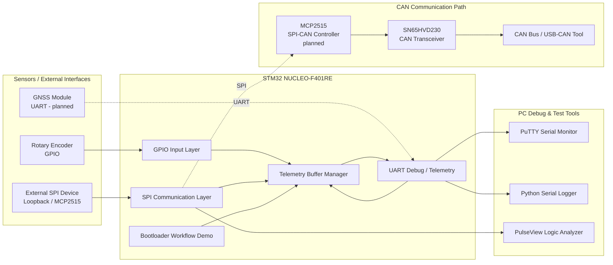
```mermaid
flowchart LR
    subgraph Inputs["Sensors / External Interfaces"]
        ENC["Rotary Encoder<br/>GPIO"]
        GNSS["GNSS Module<br/>UART - planned"]
        SPI_DEV["External SPI Device<br/>Loopback / MCP2515"]
    end

    subgraph MCU["STM32 NUCLEO-F401RE"]
        GPIO["GPIO Input Layer"]
        UART["UART Debug / Telemetry"]
        SPI["SPI Communication Layer"]
        BUF["Telemetry Buffer Manager"]
        BOOT["Bootloader Workflow Demo"]
    end

    subgraph CAN_PATH["CAN Communication Path"]
        MCP["MCP2515<br/>SPI-CAN Controller<br/>planned"]
        CANPHY["SN65HVD230<br/>CAN Transceiver"]
        BUS["CAN Bus / USB-CAN Tool"]
    end

    subgraph PC["PC Debug & Test Tools"]
        PUTTY["PuTTY Serial Monitor"]
        PY["Python Serial Logger"]
        LA["PulseView Logic Analyzer"]
    end

    ENC --> GPIO
    GNSS -. UART .-> UART
    SPI_DEV --> SPI

    GPIO --> BUF
    SPI --> BUF
    UART --> BUF
    BOOT --> BUF

    BUF --> UART
    SPI -. SPI .-> MCP
    MCP --> CANPHY
    CANPHY --> BUS

    UART --> PUTTY
    UART --> PY
    SPI --> LA

```

---

# Development Roadmap

- [x] Step 1 — STM32 board bring-up and UART debugging
- [x] Step 2 — Rotary encoder GPIO integration
- [x] Step 3 — SPI loopback packet communication with logic analyzer validation
- [x] Step 4 — CAN-ready hardware architecture and interface preparation
- [x] Step 5 — Python telemetry and serial logging tools
- [x] Step 6 — Memory management and telemetry buffering
- [x] Step 7 — UART bootloader workflow and firmware chunk buffering demo
- [x] Step 8 — MCP2515 SPI-CAN controller integration and CAN telemetry streaming
- [x] Step 9 — GNSS (NEO-M8N) UART integration

---

# Firmware Architecture

The firmware is organized in a modular and incremental manner to simulate real embedded product development workflows.

Main architectural concepts demonstrated:

- HAL-based peripheral initialization
- UART debug and telemetry interfaces
- SPI packet-based communication
- Static telemetry buffering
- Bootloader state-machine concepts
- Deterministic memory allocation
- Hardware abstraction and interface separation
- Debug-driven firmware validation workflow

The project emphasizes low-level embedded debugging, communication interface validation, and scalable firmware organization.

---


# Step 1 — STM32 Board Bring-up

## Objective

Verify:
- STM32 firmware flashing
- GPIO control
- UART serial communication
- STM32CubeIDE workflow
- ST-LINK debugging interface

---

## Implemented Features

- Configured STM32 NUCLEO-F401RE using STM32CubeIDE
- Enabled USART2 virtual COM port for UART debugging
- Implemented LED heartbeat on onboard LED (PA5)
- Verified firmware flashing and continuous execution
- Verified UART serial communication through USB ST-LINK interface

---

## UART Output

```text
System alive
System alive
System alive
```

## GPIO Heartbeat

The onboard LD2 LED connected to PA5 toggles every 500 ms to indicate active firmware execution.

## STM32CubeIDE Pin Configuration
| Peripheral  | Pin | Function        |
| ----------- | --- | --------------- |
| USART2_TX   | PA2 | UART transmit   |
| USART2_RX   | PA3 | UART receive    |
| GPIO_Output | PA5 | LD2 onboard LED |


## Project Structure
```
firmware/
docs/
images/
logic_analyzer/
python_tools/
```
## Images

### STM32CubeIDE Configuration

<p align="center">
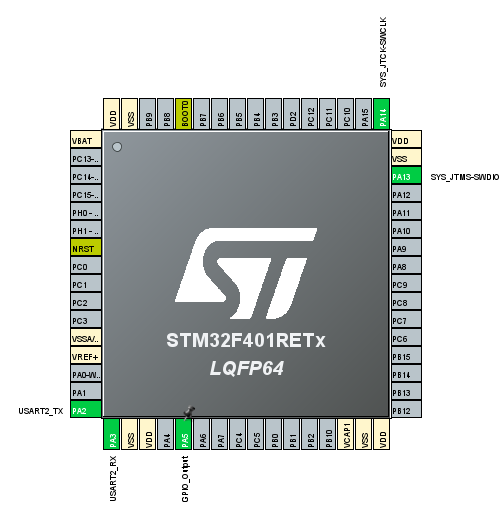
</p>


### UART Serial Output
<p align="center">
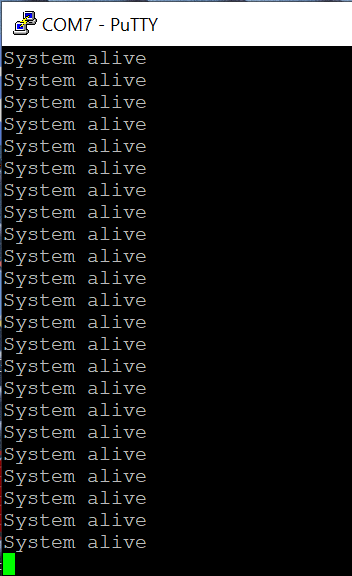
</p>

### NUCLEO-F401RE Bring-up
<p align="center">
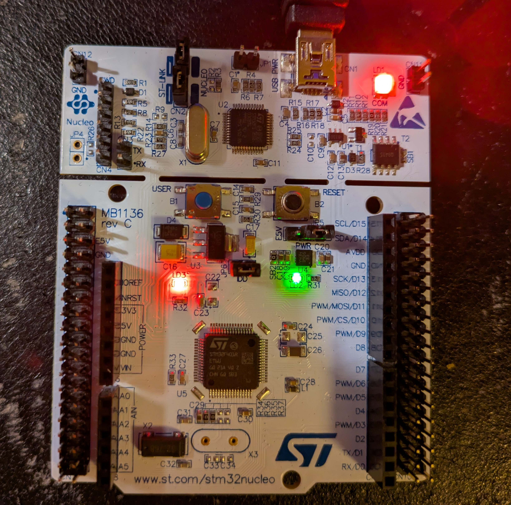
</p>

<p align="center">

</p>

---

# Step 2 — Rotary Encoder GPIO Integration

## Objective

Interface a mechanical rotary encoder with the STM32 NUCLEO-F401RE using GPIO inputs and monitor encoder state transitions through UART debugging.

This step demonstrates external sensor integration, GPIO pull-up configuration, and real-time signal monitoring in an embedded firmware environment.

---

## Hardware Used

- STM32 NUCLEO-F401RE
- EN11-HSM rotary encoder
- Dupont jumper wires
- STM32CubeIDE
- PuTTY serial terminal

---

## Encoder Interface

The encoder was connected using two GPIO input channels and one common ground connection.

### Encoder Wiring

| Encoder Pin | STM32 Pin | Function |
|---|---|---|
| Left pin | D9 / PC7 | Encoder channel B |
| Middle pin | GND | Common ground |
| Right pin | D10 / PB6 | Encoder channel A |

---

## GPIO Configuration

Both encoder GPIO inputs were configured using STM32 internal pull-up resistors.

| STM32 Pin | Configuration |
|---|---|
| PB6 | GPIO_Input + Pull-up |
| PC7 | GPIO_Input + Pull-up |

---

## Firmware Functionality

The firmware continuously polls the encoder GPIO states and streams the real-time logic levels over UART.

### UART Monitoring Example

```text
A=0 B=0
A=1 B=0
A=1 B=1
```
These transitions confirm successful dual-channel encoder signal acquisition.

### UART Debugging

UART output was monitored through the ST-LINK virtual COM interface using PuTTY at:
````
115200 baud
8 data bits
No parity
1 stop bit
````
### Features Demonstrated
- STM32 GPIO input configuration
- Internal pull-up resistor usage
- External sensor integration
- Quadrature encoder signal monitoring
- UART-based real-time debugging
- Embedded firmware polling architecture

## Images

### Rotary Encoder Hardware Setup
<p align="center">
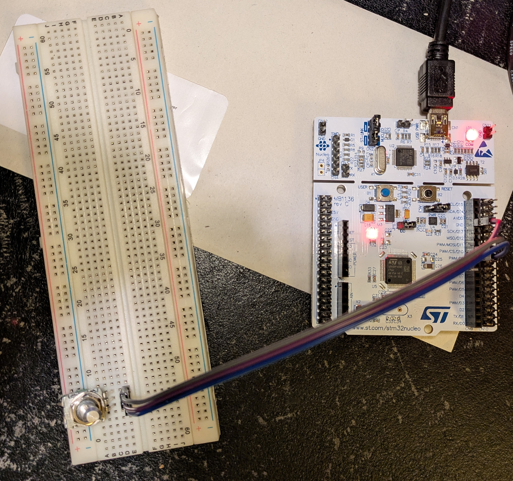
</p>

### UART Encoder Signal Output
<p align="center">
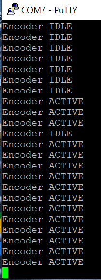
</p>

<p align="center">
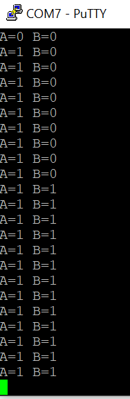
</p>

### STM32CubeIDE GPIO Configuration
<p align="center">
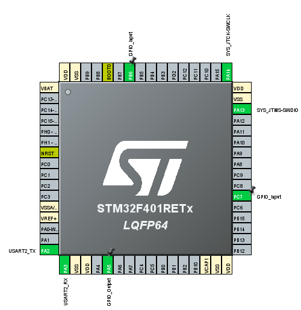
</p>

---

# Step 3 — SPI Loopback Packet Communication

## Objective

Validate STM32 SPI peripheral configuration and full-duplex packet communication using an SPI loopback setup.

This step establishes the SPI communication layer required for future MCP2515 SPI-CAN controller integration.

---

## Hardware Used

- STM32 NUCLEO-F401RE
- Dupont jumper wires
- STM32CubeIDE
- PuTTY serial terminal

---

## SPI Configuration

SPI1 was configured in Full-Duplex Master mode.

| SPI Signal | STM32 Pin | NUCLEO Pin |
|---|---|---|
| SPI1_MOSI | PA7 | D11 |
| SPI1_MISO | PA6 | D12 |
| SPI1_SCK | PB3 | - |

---

## Loopback Wiring

A loopback connection was created by connecting:

```text
D11 (MOSI) ↔ D12 (MISO)

```

## Firmware Functionality
The firmware periodically transmits a 4-byte packet through SPI and verifies the received packet through UART debugging.

## SPI Packet Example
```
SPI TX: A5 01 02 03
SPI RX: A5 01 02 03
```
## SPI Validation Using Logic Analyzer

SPI communication was validated using a PulseView-compatible logic analyzer.

The following signals were monitored:

- SPI clock (SCK)
- MOSI
- MISO

The captured traces confirmed:
- correct clock generation
- synchronized data transfer
- full-duplex packet integrity
- successful loopback reception

Successful packet matching confirms:

- SPI peripheral configuration
- full-duplex communication
- data transmission integrity
- loopback reception functionality

## Features Demonstrated
- STM32 SPI peripheral configuration
- Full-duplex SPI communication
- Embedded packet transmission/reception
- UART-assisted debugging
- Hardware loopback testing
- Preparation for MCP2515 SPI-CAN controller integration

## Images
### SPI Loopback Hardware Setup
<p align="center">
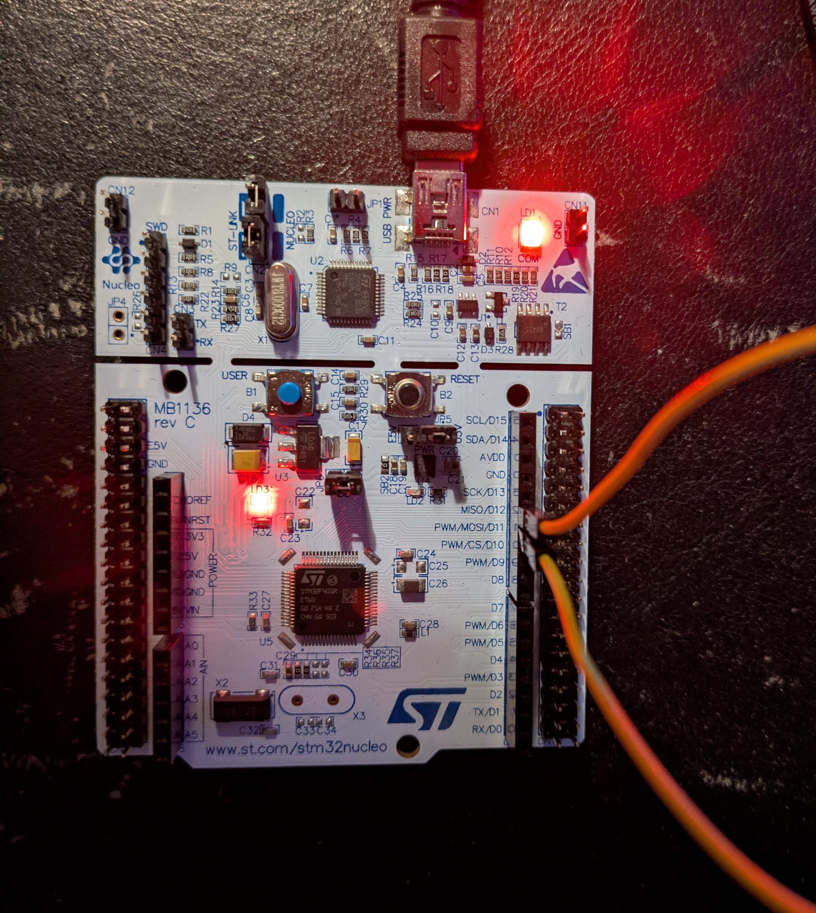
</p>

### SPI Loopback Logic analyzer Hardware Setup
<p align="center">

</p>
<p align="center">
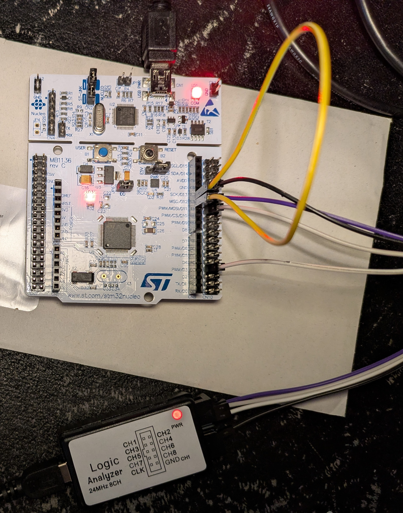
</p>

### SPI UART Output
<p align="center">
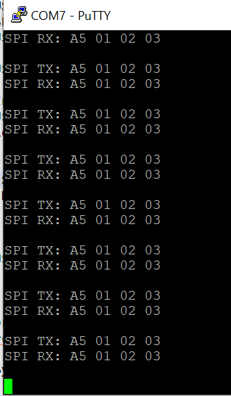
</p>

### SPI Logic Analyzer Output
<p align="center">
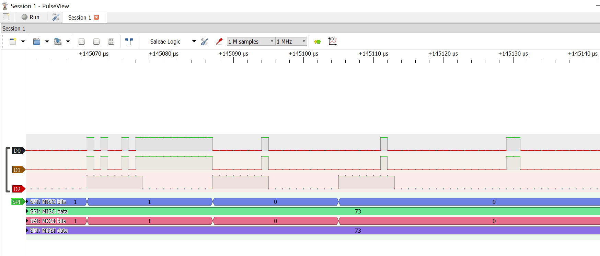
</p>

### STM32CubeIDE SPI Configuration
<p align="center">
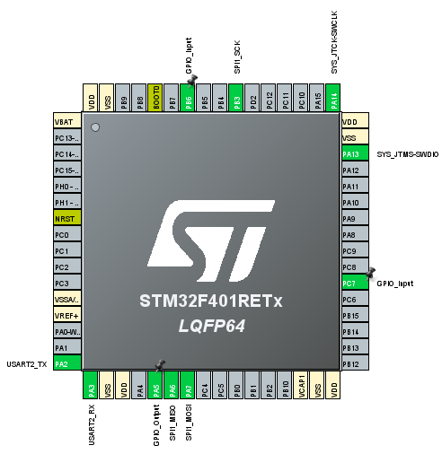
</p>

---

# Step 4 — CAN Interface Architecture and Hardware Bring-up

## Objective

Prepare a scalable CAN telemetry architecture using STM32, MCP2515 SPI-CAN controller, and SN65HVD230 CAN transceiver hardware.

This step focuses on:
- embedded communication architecture
- CAN hardware integration planning
- SPI-to-CAN interfacing workflow
- hardware bring-up and validation
- preparation for future CAN telemetry implementation

---

## Hardware Used

- STM32 NUCLEO-F401RE
- SN65HVD230 CAN transceiver module
- USB-CAN adapter (CH340-based)
- Dupont jumper wires
- STM32CubeIDE

---

## CAN Architecture
The STM32F401RE MCU does not contain an internal CAN controller peripheral.

To support CAN communication, the system architecture was designed using:

- MCP2515 external SPI-CAN controller
- SN65HVD230 CAN transceiver

## Planned CAN Communication Architecture
```
STM32F401RE
    │ SPI
    ▼
MCP2515 CAN Controller
    │ CAN TX/RX
    ▼
SN65HVD230 CAN Transceiver
    │ CANH/CANL
    ▼
USB-CAN Adapter / Vehicle CAN Bus
```

## Hardware Bring-up
The following hardware interfaces were successfully connected and verified:
| Interface            | Status                |
| -------------------- | --------------------- |
| STM32 ↔ SN65HVD230   | Connected             |
| SN65HVD230 ↔ USB-CAN | Connected             |
| USB-CAN ↔ PC         | Detected successfully |
| CH340 USB Interface  | Enumerated on COM8    |

## Features Demonstrated
- CAN communication architecture design
- Third-party module integration planning
- Embedded hardware bring-up
- USB-CAN interface preparation
- CH340 USB device enumeration
- SPI-to-CAN integration workflow preparation

## Images
### CAN Hardware Setup
<p align="center">

</p>
<p align="center">
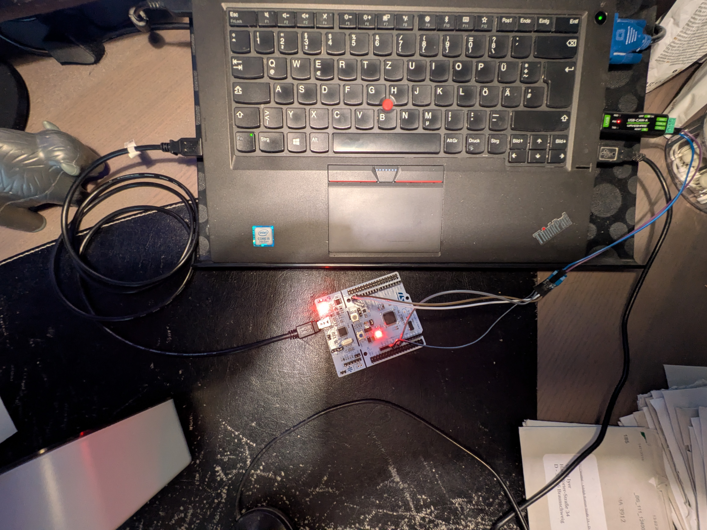
</p>

### USB-CAN Detection
<p align="center">
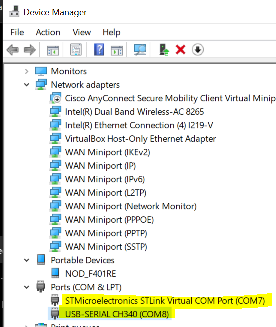
</p>

---

# Step 5 — Python Telemetry and Serial Logging Tools

## Objective

Develop a Python-based telemetry logging tool to monitor and record live UART data transmitted from the STM32 embedded platform.

This step establishes the software-side telemetry infrastructure required for:
- GNSS data logging
- CAN telemetry monitoring
- sensor debugging
- embedded system validation

---

## Hardware Used

- STM32 NUCLEO-F401RE
- USB connection to PC

---

## Software Used

- Python 3.12
- pyserial
- STM32CubeIDE
- Windows PowerShell

---

## System Architecture

```text
STM32 UART Telemetry
        │
        ▼
USB Virtual COM Port (COM7)
        │
        ▼
Python Serial Logger
        │
        ▼
Console Monitoring + CSV Logging
```

## Python Serial Logger Features
The Python telemetry logger performs the following tasks:
- Opens STM32 virtual COM port
- Reads UART telemetry data continuously
- Adds PC-side timestamps
- Displays live telemetry in terminal
- Saves telemetry data to CSV file

### Python Dependencies
Installed using:
```
pip install pyserial 
```
### CSV Logging
Telemetry data is automatically saved into:
```
telemetry_log.csv
```
Example CSV structure:
| timestamp_pc        | elapsed_s | uart_line           |
| ------------------- | --------- | ------------------- |
| 2026-05-13T20:15:10 | 0.250     | Telemetry heartbeat |

## Features Demonstrated
- Python serial communication
- Embedded telemetry logging
- UART monitoring tools
- Timestamped data acquisition
- PC-side debug tooling
- Embedded software validation workflow

## Files
| File                            | Description                     |
| ------------------------------- | ------------------------------- |
| `python_tools/serial_logger.py` | Python UART telemetry logger    |
| `telemetry_log.csv`             | Example logged telemetry output |

## Images
### Python Serial Logger Output
<p align="center">
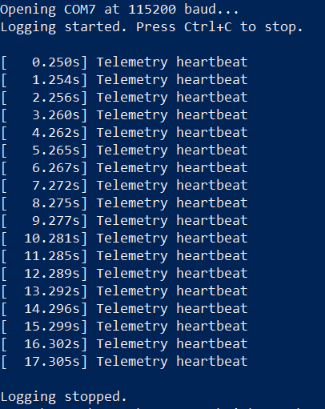
</p>

## Notes
This Python tooling provides a reusable validation and testing framework for future embedded communication modules.

---

# Step 6 — Memory Management and Telemetry Buffering

## Objective

Implement a lightweight telemetry buffering system using statically allocated memory for deterministic embedded data handling.

This step introduces:
- fixed-size telemetry packets
- ring-buffer style storage
- timestamped telemetry logging
- memory-safe embedded firmware design

---

## Features Implemented

- Static telemetry packet structure
- Fixed-size telemetry buffer
- Circular write indexing
- SPI telemetry packet storage
- UART debug monitoring

---

## Telemetry Packet Structure

```c
typedef struct
{
    uint32_t timestamp_ms;
    uint8_t spi_tx[4];
    uint8_t spi_rx[4];
    uint8_t spi_ok;
} TelemetryPacket_t;
```
## Example UART Output
```
SPI TX: A5 01 02 03
SPI RX: A5 01 02 03
Telemetry buffered: index=1 count=16 spi_ok=1 timestamp=54471
```

## Features Demonstrated
- Embedded memory management
- Static allocation techniques
- Circular telemetry buffering
- Deterministic firmware behavior
- Embedded diagnostics and monitoring

## Images
### Telemetry Buffer Debug Output
<p align="center">
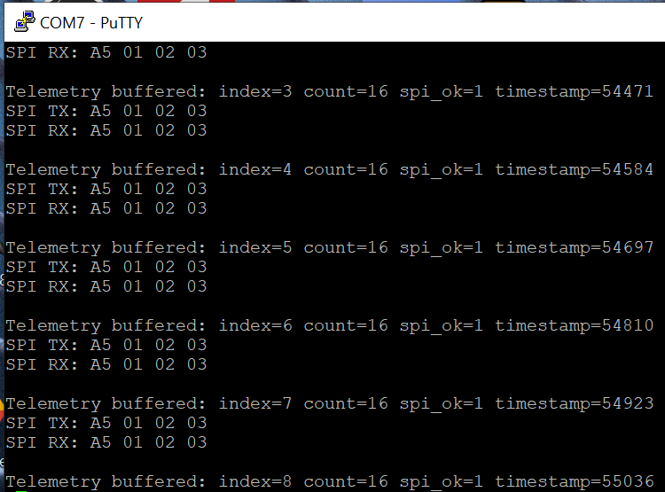
</p>

## Notes
The telemetry buffering framework will later be reused for:

- GNSS telemetry packets
- CAN message buffering
- sensor data logging
- embedded communication diagnostics


# Step 7a — Bootloader and Firmware Update Workflow

## Objective

Document a future-ready STM32 firmware deployment and bootloader architecture for telemetry applications.

## Topics Covered

- STM32 bootloader concepts
- firmware deployment workflow
- flash memory organization
- future OTA update architecture
- firmware safety considerations

## Files

| File | Description |
|---|---|
| `docs/bootloader_update_workflow.md` | Firmware update and bootloader architecture documentation |

## Features Demonstrated

- Embedded firmware architecture understanding
- Bootloader workflow concepts
- OTA update planning
- Flash memory management awareness

---

# Step 7b — UART Bootloader Workflow Demo

## Objective

Implement a lightweight UART-based bootloader workflow demonstrating:
- UART command reception
- bootloader state transitions
- firmware update command handling
- fixed-size firmware chunk reception
- static RAM buffering

This step focuses on understanding embedded firmware update architecture without modifying internal Flash memory.

---

## Features Implemented

- UART bootloader command parser
- `UPDATE` command detection
- bootloader update mode state machine
- fixed-size firmware chunk reception
- static firmware RAM buffer
- firmware chunk counter and monitoring

---

## Bootloader Workflow

```text
PC Terminal
    ↓
UART Command Reception
    ↓
UPDATE Command Detection
    ↓
Bootloader Update Mode
    ↓
Firmware Chunk Reception
    ↓
Static RAM Buffer Storage
```
## Example Bootloader Interaction
```
BOOT> Ready
BOOT> Send UPDATE to enter firmware update mode

BOOT> Type command: update
BOOT> Received: update
BOOT> Update mode entered
BOOT> Ready to receive firmware chunks

BOOT> Send 8-byte firmware chunk
ABCDEFGH

BOOT> Chunk 0 received: 41 42 43 44 45 46 47 48
BOOT> Total chunks stored: 1/8
```

## Features Demonstrated
- UART communication
- Embedded command parsing
- Bootloader state-machine design
- Static memory allocation
- Firmware chunk buffering
- Embedded update workflow concepts

## Notes
This implementation is a lightweight bootloader demonstration.
The current version:

- stores firmware chunks in RAM
- does not erase or program Flash memory
- does not implement full OTA update logic

Future extensions may include:

- Flash programming
- CAN/UART firmware updates
- firmware validation
- OTA update support

## Images
### Bootloader Update Mode
<p align="center">
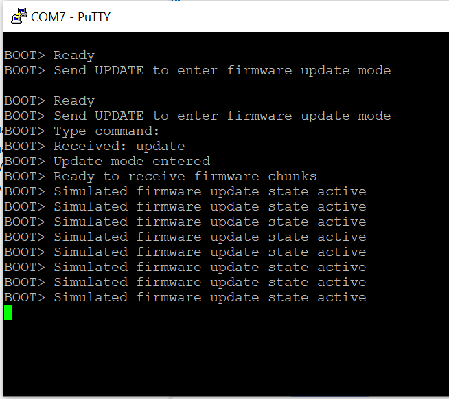
</p>

### Firmware Chunk Reception
<p align="center">
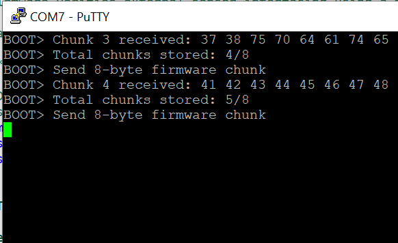
</p>

## Step 8 — MCP2515 CAN Bus Bring-Up and Telemetry Streaming

Implemented CAN communication between the STM32 NUCLEO-F401RE and a PC using an MCP2515 SPI-CAN controller module and USB-CAN adapter.

### Features
- MCP2515 SPI bring-up and register validation
- CAN controller initialization in Normal mode
- Standard CAN frame transmission (`ID = 0x123`)
- Real-time telemetry streaming over CAN bus
- Rotary encoder state and counter transmitted as CAN payload
- USB-CAN frame reception validation on PC
- Python-based CAN serial logger and frame decoder

### Hardware
- STM32 NUCLEO-F401RE
- MCP2515 + TJA1050 CAN module
- USB-CAN adapter (CH340-based)
- Rotary encoder
- Logic analyzer for SPI verification

### SPI Connections
| STM32 Nucleo | MCP2515 |
|---|---|
| D11 / PA7 | SI (MOSI) |
| D12 / PA6 | SO (MISO) |
| D3 / PB3 | SCK |
| D10 / PB6 | CS |
| 5V | VCC |
| GND | GND |

### CAN Telemetry Payload
| Byte | Description |
|---|---|
| Byte 0 | Encoder GPIO state |
| Byte 1 | Encoder counter (LSB) |
| Byte 2 | Encoder counter (MSB) |
| Byte 3 | Marker byte (`0xA5`) |

Example received payload:
```text
01 03 00 A5
```

### Python CAN Logger
Implemented a Python serial logger for decoding USB-CAN frames from the CH340 adapter.

Example decoded output:
```text
CAN ID=0x123 DLC=4 DATA=01 04 00 A5
```
### Debugging and Validation

- Verified SPI communication using PulseView logic analyzer
- Validated MCP2515 Normal mode operation:
```
CANSTAT = 0x00
CANCTRL = 0x00
```
- Diagnosed CAN bus ACK and transmission errors using:
    - TXB0CTRL
    - EFLG
    - TEC / REC counters
- Resolved USB-CAN communication issue by correcting adapter serial baud rate to 2000000

### Results
Successfully transmitted and received CAN telemetry frames between STM32 and PC over USB-CAN interface with live encoder data updates.

## Images

### STM32CubeIDE Configuration

<p align="center">
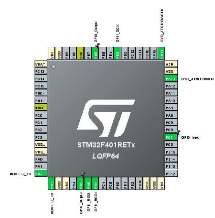
</p>

### MCP2515-CAN Hardware Setup
<p align="center">
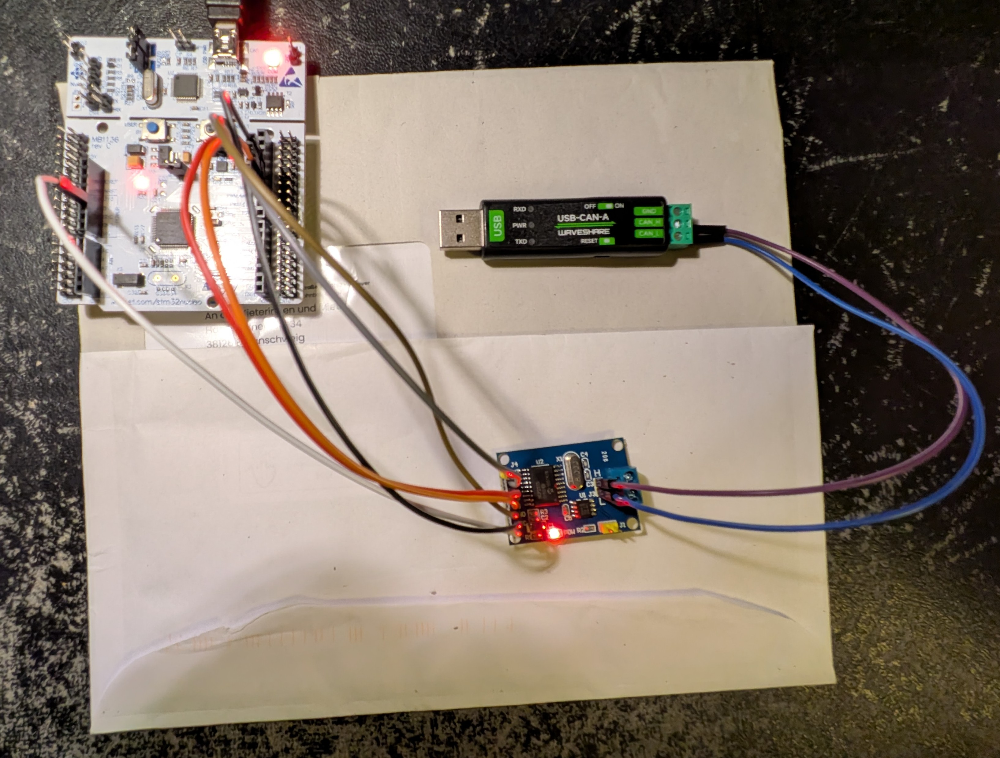
</p>

### Encoder-MCP2515-USB-CAN Hardware Setup
<p align="center">
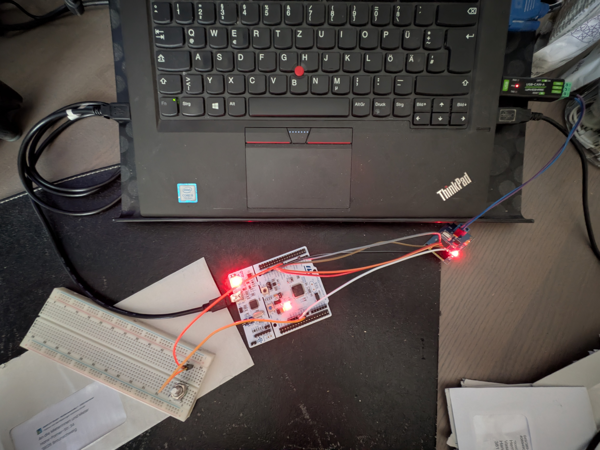
</p>

### MCP2515 CAN initialization
<p align="center">
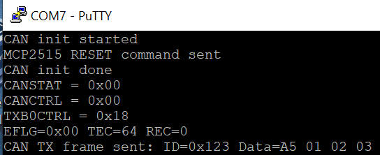
</p>

### Encoder telemetry over CAN
<p align="center">
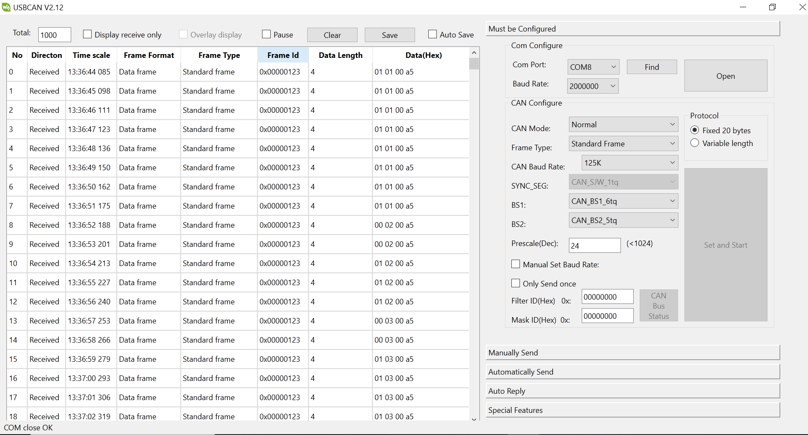
</p>

### Python CAN logger
<p align="center">
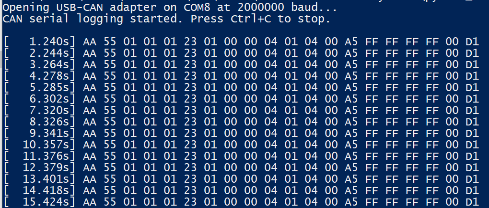
</p>
<p align="center">
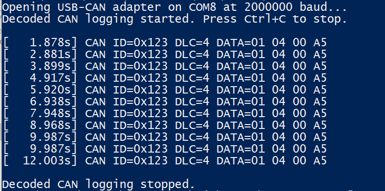
</p>

## Step 9 — GNSS (NEO-M8N) UART Integration and Telemetry Pipeline

Integrated a u-blox NEO-M8N GNSS module with the STM32 NUCLEO-F401RE platform to establish a UART-based telemetry path and validate GNSS data reception.

### Features

- GNSS UART interface bring-up using STM32 USART1
- Real-time NMEA sentence reception
- UART telemetry bridge from GNSS to PC terminal
- GNSS stream activity monitoring
- GNSS telemetry forwarding into embedded CAN workflow
- MCP2515 CAN transmission diagnostics for telemetry integration
- Modular firmware architecture for future GNSS telemetry expansion

### Hardware

- STM32 NUCLEO-F401RE
- u-blox NEO-M8N GNSS module
- MIKROE-2670 GNSS carrier board
- MCP2515 SPI-CAN controller
- USB-CAN adapter
- USB UART interface (ST-LINK Virtual COM)

### UART Connections

| GNSS Module | STM32 NUCLEO-F401RE |
|-------------|---------------------|
| TX | PA10 (USART1_RX) |
| RX | PA9 (USART1_TX) |
| 3V3 | 3V3 |
| GND | GND |

USART1 configuration:

```text
Baud Rate: 9600
Word Length: 8-bit
Parity: None
Stop Bits: 1
Mode: Asynchronous
```

### Data Flow

```text
NEO-M8N GNSS
      ↓ UART
STM32 USART1
      ↓
Telemetry processing
      ↓
USART2 debug output
      ↓
PuTTY terminal
```

Extended telemetry architecture:

```text
NEO-M8N
   ↓ UART
STM32
   ↓ SPI
MCP2515
   ↓ CAN
USB-CAN
   ↓
PC telemetry tools
```

### Example NMEA Output

```text
$GNRMC,...
$GNGGA,...
$GNGSA,...
$GPGSV,...
```

Example received output:

```text
$GPGSV,1,1,01,02,,,15*7E
$GNRMC,154044.00,V,,,,,,,220526,,,N*6F
$GNGGA,154044.00,,,,,0,00,99.99,,,,,,*7E
```

### Firmware Monitoring

GNSS telemetry activity monitored through embedded counters:

```text
CAN TX GNSS frame: stream=1 bytes=16
```

CAN controller diagnostic validation:

```text
TXB0CTRL=0x00
EFLG=0x00
TEC=0
REC=0
```

Diagnostic interpretation:

- Successful MCP2515 transmission request handling
- No CAN controller errors detected
- GNSS stream reception active
- Embedded telemetry path validated

### Results

Successfully established:

- GNSS UART communication
- NMEA telemetry reception
- STM32 telemetry processing pipeline
- GNSS integration into embedded telemetry framework
- CAN telemetry forwarding architecture for future expansion

### Screenshots

### STM32CubeIDE Configuration

<p align="center">
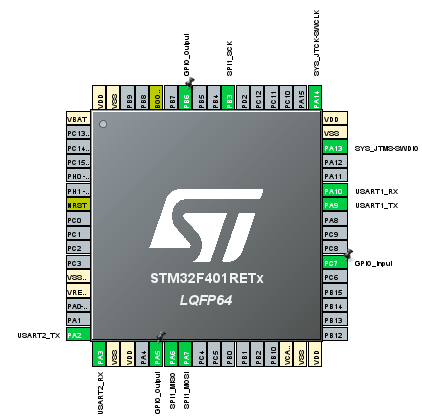
</p>

### Hardware Configuration

<p align="center">

</p>


### GNSS NMEA telemetry output

<p align="center">
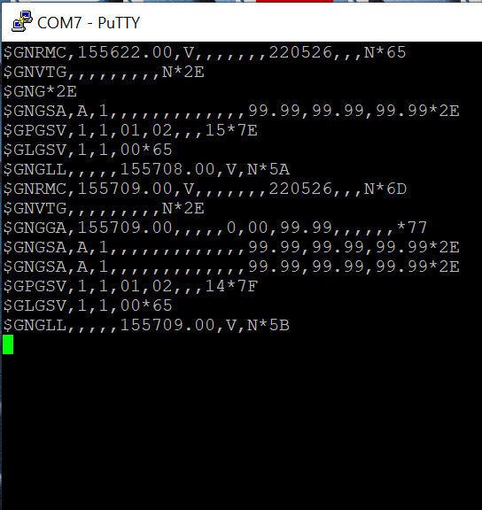
</p>

### GNSS-CAN telemetry output
<p align="center">
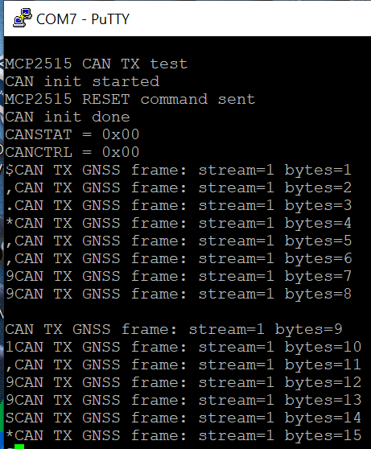
</p>

## Tool Used
- STM32CubeIDE
- STM32 HAL
- PuTTY serial terminal
- ST-LINK debugger

---

# Debugging Workflow

The project emphasizes practical low-level debugging and hardware validation techniques commonly used in embedded firmware development.

Debugging methods used throughout the project include:

- UART runtime diagnostics
- Logic analyzer–based SPI validation
- Hardware bring-up verification
- Peripheral interface testing
- Embedded telemetry monitoring
- Protocol-level communication inspection
- Incremental firmware validation

Tools used:
- PulseView logic analyzer
- STM32CubeIDE debugger
- ST-LINK interface
- PuTTY serial terminal

---

---

# Future Extensions

Planned future improvements include:

- Full MCP2515 CAN communication
- CAN telemetry transmission
- GNSS (NEO-M8N) UART integration
- CAN message logging tools
- CANopen protocol experimentation
- Flash-memory firmware updates
- OTA update workflow concepts
- RTOS-based task scheduling
- Sensor telemetry integration

---
## Author
**Vasan Iyer**   
Embedded Software Engineer

Areas of interest:
- Embedded C firmware
- STM32 microcontrollers
- Real-time embedded systems
- Communication interfaces (CAN, SPI, UART)
- FPGA-based hardware interfacing
- Embedded debugging and system integration

GitHub: https://github.com/Vaiy108